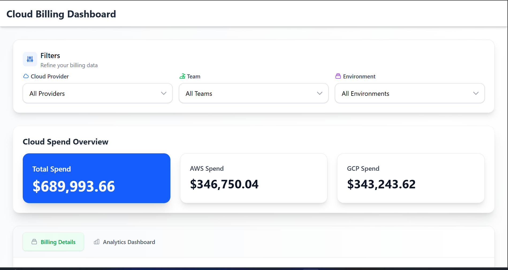
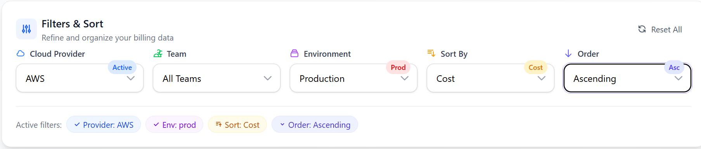
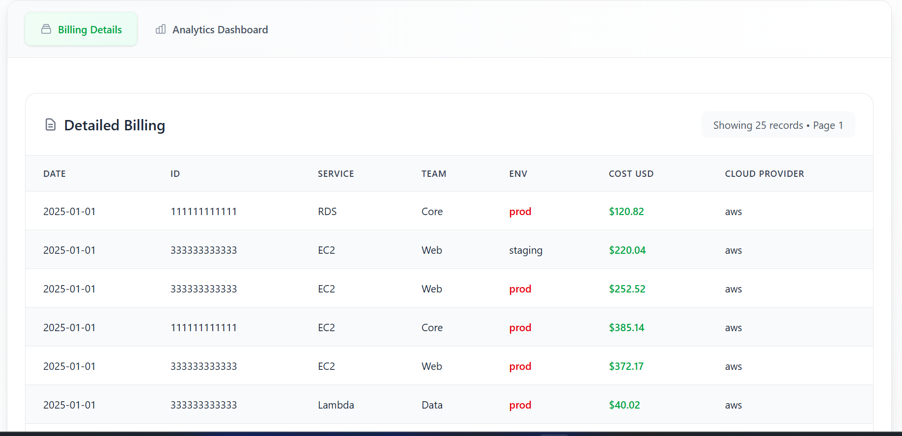
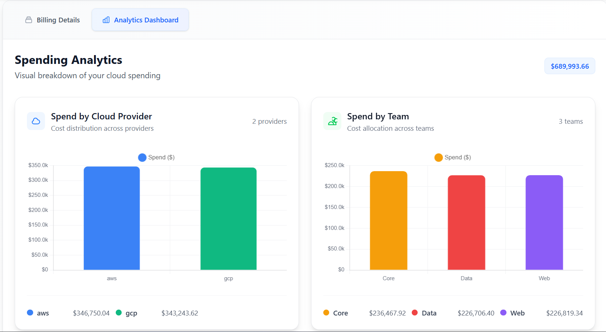
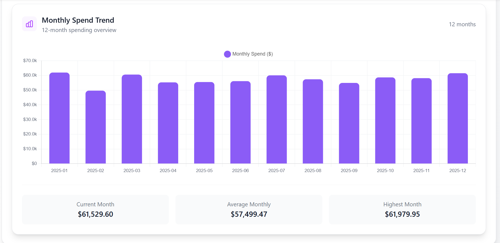

# 🌤️ Cloud Billing Dashboard

A full-stack analytics dashboard for visualizing cloud spend across AWS & GCP with filters, pagination, charts, and a clean modern UI.

---

## 🚀 How to Run the App

### **Backend (FastAPI + Pandas)**

```bash
cd backend
python -m venv venv
source venv/bin/activate      # Windows → venv\Scripts\activate
pip install -r requirements.txt
uvicorn main:app --reload
```

Backend runs at:
➡️ **[http://localhost:8000](http://localhost:8000)**

---

### **Frontend (React + Vite)**

```bash
cd frontend
npm install
npm run dev
```

Frontend runs at:
➡️ **[http://localhost:5173](http://localhost:5173)**

---

## 🧰 Tech Stack Used

### **Frontend**

* React (Vite)
* Tailwind CSS
* Chart.js (Reusable charts)
* Zustand (Global state)
* Axios

### **Backend**

* FastAPI
* Pandas
* Uvicorn
* CORS Middleware

---

## 📌 Assumptions Made

* CSV contains standard AWS/GCP billing-like fields
  (`date`, `cloud_provider`, `team`, `env`, `service`, `cost_usd`, etc.)
* `"all"` in filters means *no filtering*
* Only AWS + GCP included in spend summary
* Dates always parse correctly using `pandas.to_datetime`
* Backend always returns valid numeric cost
* Taking accound_id of AWS data and project_id of GDP data as a ID 

---

## ✅ Features Completed

### **Backend**

* Reads CSV + cleans data
* Filters by team, environment, cloud provider
* Monthly spend computation
* Spend by provider
* Summary metrics
* Pagination
* Returns JSON API
* Support query params like /api/spend?cloud=AWS&team=Core

### **Frontend**

* Filters UI using Zustand
* Summary cards with icons
* Paginated data table
* Billing Details & Analytics tab switching
* Reusable Chart.js component
* Monthly spend trend chart
* Cloud provider spend comparison chart
* Smooth UI animations
* Fully responsive Tailwind UI
* Detail View ( Click on a row to open a detail modal showing All fields for that entry )

---

## 🔮 If I Had More Time

### **Backend Enhancements**

* Add a real database (PostgreSQL) instead of CSV
* Auto-ingestion scheduler for new billing data
* User authentication (JWT)
* Spend forecasting (ML-based)

### **Frontend Enhancements**

* Dark mode
* Export options (CSV, PDF, Excel)
* Drill-down charts (team/service-level)
* Interactive date-range picker
* Chart zooming, filtering, and transitions
* Skeleton loaders and micro-animations

---

## 📁 Project Structure

```
root/
 ├── backend/
 │   ├── main.py
 │   └── requirements.txt
 ├── frontend/
 │   ├── src/
 │   │   ├── components/
 │   │   ├── store/
 │   │   └── App.jsx
 │   └── package.json
 └── README.md
```

---

## 👨‍💻 Author

Dhruvi Jingar

---

## 📸 Screenshots 








